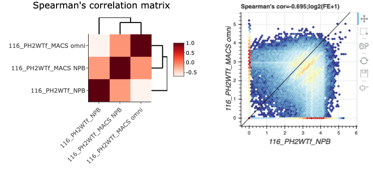

PeakApp: a shiny app showing both correlation matrix and the scatter plots 
============================================================

**Two connected intractive plots will be showing** 

- Right: the correlation matrix between samples 
- left: showing the scatter plot between two samples when you click a cell in the right correlation heatmap. 

**Input files** 
1. `sample_table.csv` or `sample_table_v2.txt` or `including_libs.txt`: define sample names or ids 
2. `avgOverlapFC.tab`:  gene by sample matrix or peak by sample matrix, which is used to caculate the correlation between samples. Column name defined in 1. 

